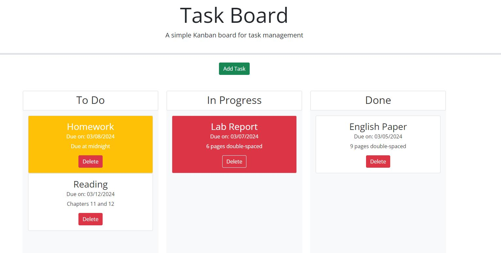

# My Project Tracker Webpage

## Description
The point of this project was to create a sleek and user-friendly project tracker that students can use to keep track of what assignments they might have coming up.  The tracker is broken down into three columns: To Do, In Progress, and Done.  Using the "Add Task" button, the user can insert a project name, a due date from a datepicker, and a brief description of the assignment.  Upon pressing the "Add Task" button in the modal form, a project card will automatically populate the To Do column with all of the information provided by the user. If an error was made, the user can simply  press the delete button on the card to get rid of it.  If the user begins but does not finish their project, they can maintain organization by dragging the card from the To Do section to the In Progress section.  When the project is complete, it can be dragged to the Done column or simply deleted.  Lastly, the cards are color coded based on the proximity of the due date.  If the project is due that day, the card will turn yellow.  If the project is overdue, the card will turn red.

## Installation
N/A

## Usage
To use the webpage, follow [this link](https://njohnson2897.github.io/my-project-tracker/)

The following screenshot demonstrates what the page should look like in a browser:

## Credits
https://jqueryui.com/draggable/

https://jqueryui.com/droppable/

https://getbootstrap.com/docs/5.3/components/modal/

I also heavily referenced the student mini project from Module 5 which had functionality that was very similar to the functionality expected for this project.